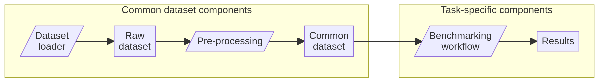

import Tabs from '@theme/Tabs';
import TabItem from '@theme/TabItem';

export const quartoRawHtml =
[`<!-- TODO: write a generic dataset loader unit test and use that instead, see #103 -->`];

A is used to generate one or more . A raw dataset is processed by the
[Dataset preprocessing
workflow](../reference/openproblems/src-datasets.qmd) to create a that
can be used by multiple benchmarking tasks.

This guide will show you how to create a new component to fetch or
generate datasets.

:::tip

Make sure you have followed the “Getting started” guide.

:::

## OpenProblems datasets

Common datasets are created by generating raw datasets with a data
loader and running them through the pre-processing pipeline
(<a href="#fig-dataflow" class="quarto-xref">Figure 1</a>). Afterwards,
further task-specific processing occurs prior to the task-specific
benchmarking workflow.

<div id="fig-dataflow">



Figure 1: Flow of data in OpenProblems benchmarks. All datasets are
processed by a common processing pipeline. Further task-specific
processing can occur at prior to the task-specific benchmarking
workflow. *Legend: Grey rectangles are AnnData .h5ad files, purple
rhomboids are Viash components.*

</div>

See the [reference
documentation](../reference/openproblems/src-datasets.qmd) for more
information on how each of these steps works.

## Step 1: Create a directory for the dataset loader

To add a dataset to OpenProblems, you will need to create a Viash
component for a dataset loader.

```bash
mkdir src/datasets/loaders/myloader
```


:::tip

Take a look at the dataset loaders that are already in the
`src/datasets/loaders`! Likely there is already a dataset loader that
already does something similar to what you need.

:::

## Step 2: Create a Viash config

Next, create a config for the dataset loader. The [Viash
config](https://viash.io/reference/config/) contains metadata of your
dataset, which script is used to run it, and the required dependencies.
The simplest dataset loader you can create looks as follows.

<Tabs groupId="language">
<TabItem value="Python">

Contents of `src/datasets/loaders/myloader/config.vsh.yaml`:

```yaml
functionality:
  name: "myloader"
  namespace: "datasets/loaders"
  description: "A new dataset loader"
  arguments:
    - name: "--output"
      __merge__: ../../api/file_raw.yaml
      direction: "output"
  resources:
    - type: python_script
      path: script.py
platforms:
  - type: docker
    image: python:3.10
    setup:
      - type: python
        pypi: anndata~=0.8.0
  - type: nextflow
```

</TabItem>
<TabItem value="R">

Contents of `src/datasets/loaders/myloader/config.vsh.yaml`:

```yaml
functionality:
  name: "myloader"
  namespace: "datasets/loaders"
  description: "A new dataset loader"
  arguments:
    - name: "--output"
      __merge__: ../../api/file_raw.yaml
      direction: "output"
  resources:
    - type: python_script
      path: script.py
platforms:
  - type: docker
    image: eddelbuettel/r2u:22.04
    setup:
      - type: r
        cran: anndata
      - type: apt
        packages: [ libhdf5-dev, libgeos-dev, python3, python3-pip, python3-dev, python-is-python3 ]
  - type: nextflow
```

</TabItem>
</Tabs>

For more parameter options, refer to [“Parameters”](#parameters)
section.

## Step 3: Create a script

Next, create a script that will generate or load the dataset. Here we
show an example script that generates a random dataset, but check out
`src/datasets/loaders` for real data examples. The script must ensure
that that the output anndata object has the format as described in the
[“Format of a raw dataset
object”](#format-of-a-raw-dataset-object-format) section.

<Tabs groupId="language">
<TabItem value="Python">

Contents of `src/datasets/loaders/myloader/script.py`:

```python
import anndata as ad
import pandas as pd
import scipy
import numpy as np
import random

## VIASH START
par = {"output": "output.h5ad"}
## VIASH END

# Create obs data for the cells
obs = pd.DataFrame({
    "cell_type": random.choices(["enterocyte", "intestine goblet cell", "stem cell"], k=100),
    "batch": random.choices(["experiment1", "experiment2"], k=100),
    "tissue": random.choices(["colon", "ileum"], k=100)
})

# Create var data for the genes
var = pd.DataFrame(
    index=["APP", "AXL", "ADA", "AMH"]
)

# Create counts data
counts = scipy.sparse.csr_matrix(
  np.random.poisson(0.3, (obs.shape[0], var.shape[0]))
)

# Create an AnnData dataset
adata = ad.AnnData(
  layers = {
    "counts": counts
  },
  obs = obs,
  var = var,
  uns = {
    "dataset_id": "my_dataset",
    "dataset_name": "My dataset",
    "data_url": "https://url.to/dataset/source",
    "data_reference": "mydatasetbibtexreference",
    "dataset_summary": "A short description of the dataset.",
    "dataset_description": "Long description of the dataset.",
    "dataset_organism": "homo_sapiens"
  }
)

# Write to file
adata.write_h5ad(par["output"], compression="gzip")
```

</TabItem>
<TabItem value="R">

Contents of `src/datasets/loaders/myloader/script.R`:

```r
library(anndata)
library(Matrix)
library(dplyr)

## VIASH START
par <- list("output" = "output.h5ad")
## VIASH END

# Create obs data for the cells
obs <- data.frame(
  "cell_type" = sample(c("enterocyte", "intestine goblet cell", "stem cell"), 100, replace = TRUE),
  "batch" = sample(c("experiment1", "experiment2"), 100, replace = TRUE),
  "tissue" = sample(c("colon", "ileum"), 100, replace = TRUE)
)

# Create var data for the genes
var <- data.frame(
  row.names = c("APP", "AXL", "ADA", "AMH")
)

# Create counts data
counts <- Matrix::rsparsematrix(
  nrow(obs), 
  nrow(var),
  density = 0.3,
  rand.x = function(n) rpois(n, 100)
)

# Create an AnnData dataset
adata <- AnnData(
  layers = list(
    "counts" = counts
  ),
  obs = obs,
  var = var,
  uns = list(
    dataset_id = "my_dataset",
    dataset_name = "My dataset",
    data_url = "https://url.to/dataset/source",
    data_reference = "mydatasetbibtexreference",
    dataset_summary = "A short description of the dataset.",
    dataset_description = "Long description of the dataset.",
    dataset_organism = "homo_sapiens"
  )
)

# Write to file
adata$write_h5ad(par[["output"]], compression = "gzip")
```

</TabItem>
</Tabs>

## Step 4: Run the component

Try running your component! You can start off by running your script
inside your IDE.

To check whether your component works as a standalone component, run the
following commands.

(Re)build the Docker container after changing the `platforms` section in
the Viash config:

```bash
viash run src/datasets/loaders/myloader/config.vsh.yaml -- \
  ---setup cachedbuild
```

Run the component:

```bash
viash run src/datasets/loaders/myloader/config.vsh.yaml -- \
  --output mydataset.h5ad
```

<div dangerouslySetInnerHTML={{ __html: quartoRawHtml[0] }} />

## Parameters

It’s possible to add arguments to the dataset loader by adding
additional entries to the `functionality.arguments` section in the
`config.vsh.yaml`. For example:

```yaml
arguments:
  - name: "--n_obs"
    type: "integer"
    description: "Number of cells to generate."
    default: 100
  - name: "--n_vars"
    type: "integer"
    description: "Number of genes to generate."
    default: 100
```

You can then use the `n_obs` and `n_vars` values in the `par` object to
get access to the runtime parameters:

<Tabs groupId="language">
<TabItem value="Python">

```python
obs = pd.DataFrame({
    "cell_type": random.choices(["enterocyte", "intestine goblet cell", "stem cell"], k=par["n_obs"]),
    "batch": random.choices(["experiment1", "experiment2"], k=par["n_obs"]),
    "tissue": random.choices(["colon", "ileum"], k=par["n_obs"])
})
var = pd.DataFrame(
    index=[f"Gene_{i}" for i in range(100)]
)
```

</TabItem>
<TabItem value="R">

```r
obs <- data.frame(
  "cell_type" = sample(c("enterocyte", "intestine goblet cell", "stem cell"), par$n_obs, replace = TRUE),
  "batch" = sample(c("experiment1", "experiment2"), par$n_obs, replace = TRUE),
  "tissue" = sample(c("colon", "ileum"), par$n_obs, replace = TRUE)
)
var <- data.frame(
  row.names = paste0("Gene_", seq_len(par$n_vars))
)
```

</TabItem>
</Tabs>

## Format of a raw dataset object

Ideally, the AnnData output object should at least contain the following
slots:

``` text
## File format: raw.h5ad

NA

Example file: `resources_test/common/pancreas/raw.h5ad`
```
