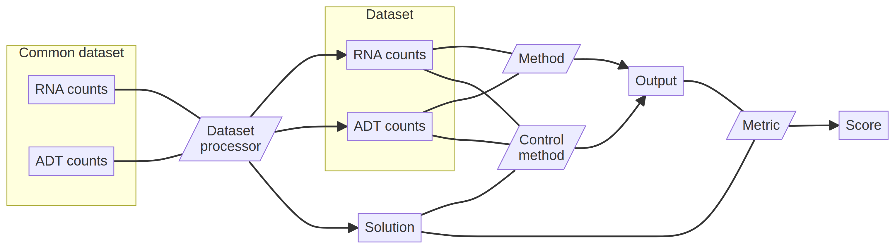

:::note

The task_template repository that has been used to create the new task
already contains most of the files needed for the API. You just need to
update them according to the specs for your task.

:::

After Updating the task config file (see “[Define
task](getting_started.qmd#step-6-update-the-task-config-file)”), we will
next define the type of components and file formats your task consists
of. Concretely, you need to define:

-   Which **types of ** your task consists of, that is, , , , and .
-   Which each of these component types has, that is, one or more input
    files and one or more output files.
-   The of each of these files (typically an ).

When put together, a typical task API looks somewhat like this:

<div id="fig-task-workflow">


Figure 1: Overview of a typical benchmarking workflow in an OpenProblems
task. *Legend: Grey rectangles are AnnData .h5ad files, purple rhomboids
are Viash components.*

</div>

The [dimensionality
reduction](https://github.com/openproblems-bio/task_dimensionality_reduction/tree/main/src/api)
task is an example of an OpenProblems task with this topology, where the
output is an embedding of the original dataset, and the solution is cell
annotations which are used to verify whether the resulting embedding
represents the intended biological information.

# Why?

Having a formally defined API ensures consistency and interoperability
across different components of your task. This makes it easier for
others to contribute and build upon your work. Not only that, but
creating API files (partially) automates the following steps:

-   Creating new [methods](../create_component/add_a_method.qmd) and
    [metrics](../create_component/add_a_metric.qmd) using the
    `create_component` scripts.
-   [Automated testing](../create_component/run_tests.qmd) of
    components.
-   Generating [reference documentation](../reference/).
-   Implement a component for [processing the common
    datasets](dataset_processor.qmd).

# How?

We’ll need to create API files for each component and AnnData file
separately. However, this is actually quite easy to do, as we will show
in the following sections.

# Step 1: Create task API diagram {#step-1}

First start by creating a diagram similar to what is shown in
<a href="#fig-task-workflow" class="quarto-xref">Figure 1</a>. We
recommend drawing the diagram on paper at first.

Here are the most common types of components and file formats:

-   : OpenProblems offers a standard collection of
    [datasets](../datasets), which can be used to kickstart a new task.
-   : This component ingests a Common dataset and splits it into one or
    more task-specific dataset objects. We recommend at least having a
    Dataset and Solution object, such that a Method component never
    “sees” the ground-truth information needed by the Metric component.
-   : The data used by a method to create an output (i.e. prediction).
-   **Solution**: The ground-truth information needed by a Metric to
    compare an output against. It’s highly recommended to store the
    ground-truth information as a separate AnnData object, such that a
    Method cannot (accidentally) cheat.
-   : An algorithm used to make predictions for or process an input
    dataset in some way.
-   : A quality control for methods, metrics and the pipeline as a
    whole. A control method can either be a positive control (which uses
    the ground-truth information in from the solution to create a
    perfect output) or a negative control (which uses random
    distributions to generate outputs in the correct format).
-   **Output**: The output generated by a (control) method.
-   : A quatitative measure used to evaluate the performance of a
    method.
-   **Score**: An AnnData object containing one or more metric values.

<a href="#fig-example-traintest" class="quarto-xref">Figure 2</a> and
<a href="#fig-example-multimodal" class="quarto-xref">Figure 3</a> are
examples of two OpenProblems tasks with slightly different workflow
layouts.

<div id="fig-example-traintest">


Figure 2: Example of a task where a dataset’s cells are split into a
training dataset and test dataset. Example: in the [Label
projection](https://github.com/openproblems-bio/task_label_projection/tree/main/src/api)
task, the Train dataset contains both the raw counts and the cell type
labels of one set of cells, while the Test and Solution datasets contain
the raw counts and cell type labels of the remaining set of cells
(respectively).

</div>
<div id="fig-example-multimodal">



Figure 3: Example of a multimodal task. Example: in the [Predict
modality](https://github.com/openproblems-bio/task_predict_modality/tree/main/src/api)
task, a dataset consists of both an RNA AnnData and ADT AnnData.
However, the RNA and ADT/ATAC AnnData objects are stored as two separate
files.

</div>

# Step 2: Create file formats {#step-2}

Now that you’ve created the topology of the task workflow, the next step
is to translate that information into the required file format
specification files.

Let’s start by creating one for the solution object:

```yaml title="src/api/file_solution.yaml"
type: file
example: "resources_test/<task_id>/cxg_mouse_pancreas_atlas/solution.h5ad"
label: Solution
summary: "FILL IN: what this file represents"
info:
  format:
```

Line 1  
This YAML file will be used to define the arguments of a Viash
component. This must always be set to
[`type: file`](https://viash.io/reference/config/arguments/file.html).

Line 2  
An example of this file. At this stage, this file does not exist yet,
but it will be created later on, as this file is used for unit testing
components.

Line 3  
A short label used to represent the file in diagrams in the reference
documentation.

Line 4  
Summary of the file, useful for quickly understanding what type of data
such a file represents. Used for generating reference documentation.

Line 6  
Which slots need to be present in the file which will be defined in
[Step 4](#step-4). First define the `type` field. In this case, the file
is an AnnData file, so the type is `h5ad`. Next, define the slots that
are expected in the file.

Create a YAML file for each of the other AnnData files in the task
workflow. For example, `src/api/file_dataset.yaml`,
`src/api/file_output.yaml`, and so on.

:::tip

Each file format specification file is actually a [Viash file
argument](https://viash.io/reference/config/arguments/file.html). That’s
because these YAML files will be used as arguments in the different
component types.

:::

# Step 3: Create component types {#step-3}

Next, we will create the API specification files for each of the
components (i.e. purple rhomboids) in your diagram.

Start by creating the method component type:

```yaml title="src/api/comp_method.yaml"
namespace: methods
info:
  type: method
  type_info:
    label: "Method"
    summary: "FILL IN: A short summary of what this type of component does."
    description: "FILL IN: A description of what this type of component does."
arguments:
  - name: "--input"
    __merge__: file_dataset.yaml
    required: true
  - name: "--output"
    __merge__: file_prediction.yaml
    required: true
    direction: output
```

Line 1  
The `namespace` for the component type. format `<component_type>`. The
namespace is used to group similar components together and ensures that
they can be easily found and used within the task.

Line 2  
Metadata about the component type.

Line 3  
A unique identifier for the type of component.

Line 5  
A formatted label for the component type.

Line 6  
A short summary of the component type.

Line 7  
A Description of the component type.

Line 8  
The `arguments` that the component accepts. Each argument has a name
(e.g., `--input`), a direction (`input` (default) or `output`) and
whether it’s required or not. Note that this information is partially
provided by merging the file API YAML file specified earlier, using the
`__merge__` notation.

Create a YAML file for each of the other component types files in the
task workflow. For example, `src/api/comp_dataset_processor.yaml`,
`src/api/comp_metric.yaml`, and so on.

:::tip

Again, each component type is formatted as a [Viash config
file](https://viash.io/reference/config/), because they will be used to
create components.

:::

# Step 4: Add slots to file formats {#step-4}

Finally, the last step is to define the actual required and optional
slots each of the file format specifications. Since each of these files
are AnnData HDF5 files, the file format specifications is structured
analagously to the [AnnData data
structures](https://anndata.readthedocs.io/en/latest/generated/anndata.AnnData.html):
`layers`, `obs`, `obsm`, `obsp`, `var`, `varm`, `varp`, and `uns`.

Below is the slot information of the solution AnnData object:

```yaml title="src/api/file_solution.yaml"
type: file
description: "FILL IN: what this file represents"
example: "resources_test/<task_id>/cxg_mouse_pancreas_atlas/solution.h5ad"
info:
  label: Solution
  format:
    type: h5ad
    layers:
      - type: integer
        name: counts
        description: Raw counts
      - type: double
        name: normalized
        description: Normalized counts
    obs:
      - type: string
        name: label
        description: Ground truth cell type labels
      - type: string
        name: batch
        description: Batch information
    var:
      - type: boolean
        name: hvg
        description: Whether or not the feature is considered to be a 'highly variable gene'
        required: true
      - type: integer
        name: hvg_score
        description: A ranking of the features by hvg.
        required: true
    obsm:
      - type: double
        name: X_pca
        description: The resulting PCA embedding.
        required: true
    uns:
      - type: string
        name: dataset_id
        description: "A unique identifier for the dataset"
        required: true
      - type: string
        name: normalization_id
        description: "Which normalization was used"
        required: true
page-navigation: true
```

Line 6  
The mandatory and optional slots in the data file.

Line 7  
Specify the file format. In this case, it’s an AnnData file. We support
`h5ad`, `csv` or `parquet`.

Line 8  
Specification of one or more AnnData layers (matrices).

Line 15  
Specification for cell-level metadata (one or more columns).

Line 22  
Specification for feature-level metadata (one or more columns).

Line 31  
Specification for unstructured data.

Line 36  
Other AnnData slots.

:::note

For a csv and parquet file items 3-7 would be the columns in the file.

:::

Each required or optional slot in the file format should have the
following fields:

-   `name`: The name of the slot.
-   `type`: Which data type (string, boolean, integer or double).
-   `description`: What this data represents.
-   `required`: Whether or not this slot is required (default: `true`).

Go through each file format specification file and add the expected
slots accordingly.

:::tip

Look at the [Common
dataset](../reference/openproblems/src-datasets.qmd#file-format-common-dataset)
reference docs to see which slots the common datasets have. The AnnData
file at `resources_test/common/cxg_mouse_pancreas_atlas/dataset.h5ad` is
also an example of a Common dataset, though note that this object
contains *more* slots than what is defined by the spec.

:::
