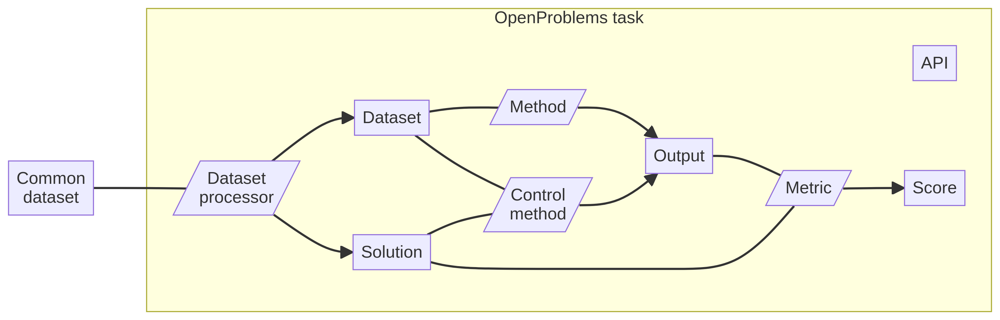

Before defining a new in OpenProblems, it’s important to understand the
typical structure of an OpenProblems task
(<a href="#fig-task-workflow" class="quarto-xref">Figure 1</a>).

A task typically consists of a data processors, methods, control methods
and metrics. Each component has a well-defined input-output interface,
for which the file formats in the resulting AnnData are also described.

Figure 1: Overview of a typical benchmarking workflow in an OpenProblems
task. *Legend: Grey rectangles are AnnData .h5ad files, purple rhomboids
are Viash components.*

## File and component formats

Path: `src/api`

This folder contains task-specific and . More specifically:

-   `file_*.yaml`: File format specifications for the task.
-   `comp_*.yaml`: Component interface specifications for the task.

## Data processors

Path: `src/data_processors`

This folder contains components that transforms a into task-specific
dataset objects. The component has been proided by default. In
supervised tasks, this component will usually output a solution, a
training dataset and a test dataset. In unsupervised tasks, this
component usually output a solution and a masked dataset.

## Methods

Path: `src/methods`

This folder contains components. Each method component outputs a
prediction given the training and test datasets (when applicable).

## Control methods

Path: `src/control_methods`

This folder contains for the task. These components have the same
interface as the regular methods but also receive the solution object as
input. It serves as a starting point to test the relative accuracy of
new methods in the task, and also as a quality control for the metrics
defined in the task. A control method can either be a positive control
or a negative control, which set a maximum and minimum threshold for
performance, so any new method should perform better than the negative
control methods and worse than the positive control method.

A *positive control* is a method where the expected results are known,
thus resulting in the best possible value for any metric outcome
measure.

A *negative control* is a simple, naive, or random method that does not
rely on any sophisticated techniques or domain knowledge.

## Metrics

Path: `src/metrics`

This folder contains components. Each metric component outputs one or
more metric results given a solution object and a method output object.

## Benchmarking pipeline

Path: `src/workflows`

This folder contains a workflow defining the benchmarking workflow for
this task.
