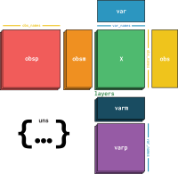
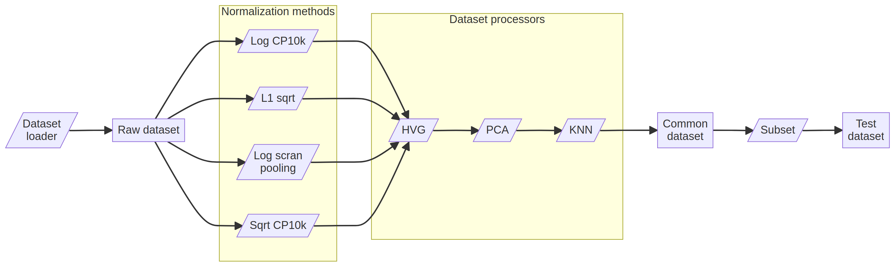

export const quartoRawHtml =
[`
<table>
<colgroup>
<col style="width: 9%" />
<col style="width: 1%" />
<col style="width: 88%" />
</colgroup>
<thead>
<tr class="header">
<th style="text-align: left;">Slot</th>
<th style="text-align: left;">Type</th>
<th style="text-align: left;">Description</th>
</tr>
</thead>
<tbody>
<tr class="odd">
<td style="text-align: left;"><code>obs["dataset_id"]</code></td>
<td style="text-align: left;"><code>string</code></td>
<td style="text-align: left;">(<em>Optional</em>) Identifier for the dataset from which the cell data is derived, useful for tracking and referencing purposes.</td>
</tr>
<tr class="even">
<td style="text-align: left;"><code>obs["assay"]</code></td>
<td style="text-align: left;"><code>string</code></td>
<td style="text-align: left;">(<em>Optional</em>) Type of assay used to generate the cell data, indicating the methodology or technique employed.</td>
</tr>
<tr class="odd">
<td style="text-align: left;"><code>obs["assay_ontology_term_id"]</code></td>
<td style="text-align: left;"><code>string</code></td>
<td style="text-align: left;">(<em>Optional</em>) Experimental Factor Ontology (<code>EFO:</code>) term identifier for the assay, providing a standardized reference to the assay type.</td>
</tr>
<tr class="even">
<td style="text-align: left;"><code>obs["cell_type"]</code></td>
<td style="text-align: left;"><code>string</code></td>
<td style="text-align: left;">(<em>Optional</em>) Classification of the cell type based on its characteristics and function within the tissue or organism.</td>
</tr>
<tr class="odd">
<td style="text-align: left;"><code>obs["cell_type_ontology_term_id"]</code></td>
<td style="text-align: left;"><code>string</code></td>
<td style="text-align: left;">(<em>Optional</em>) Cell Ontology (<code>CL:</code>) term identifier for the cell type, offering a standardized reference to the specific cell classification.</td>
</tr>
<tr class="even">
<td style="text-align: left;"><code>obs["development_stage"]</code></td>
<td style="text-align: left;"><code>string</code></td>
<td style="text-align: left;">(<em>Optional</em>) Stage of development of the organism or tissue from which the cell is derived, indicating its maturity or developmental phase.</td>
</tr>
<tr class="odd">
<td style="text-align: left;"><code>obs["development_stage_ontology_term_id"]</code></td>
<td style="text-align: left;"><code>string</code></td>
<td style="text-align: left;">(<em>Optional</em>) Ontology term identifier for the developmental stage, providing a standardized reference to the organism’s developmental phase. If the organism is human (<code>organism_ontology_term_id == 'NCBITaxon:9606'</code>), then the Human Developmental Stages (<code>HsapDv:</code>) ontology is used. If the organism is mouse (<code>organism_ontology_term_id == 'NCBITaxon:10090'</code>), then the Mouse Developmental Stages (<code>MmusDv:</code>) ontology is used. Otherwise, the Uberon (<code>UBERON:</code>) ontology is used.</td>
</tr>
<tr class="even">
<td style="text-align: left;"><code>obs["disease"]</code></td>
<td style="text-align: left;"><code>string</code></td>
<td style="text-align: left;">(<em>Optional</em>) Information on any disease or pathological condition associated with the cell or donor.</td>
</tr>
<tr class="odd">
<td style="text-align: left;"><code>obs["disease_ontology_term_id"]</code></td>
<td style="text-align: left;"><code>string</code></td>
<td style="text-align: left;">(<em>Optional</em>) Ontology term identifier for the disease, enabling standardized disease classification and referencing. Must be a term from the Mondo Disease Ontology (<code>MONDO:</code>) ontology term, or <code>PATO:0000461</code> from the Phenotype And Trait Ontology (<code>PATO:</code>).</td>
</tr>
<tr class="even">
<td style="text-align: left;"><code>obs["donor_id"]</code></td>
<td style="text-align: left;"><code>string</code></td>
<td style="text-align: left;">(<em>Optional</em>) Identifier for the donor from whom the cell sample is obtained.</td>
</tr>
<tr class="odd">
<td style="text-align: left;"><code>obs["is_primary_data"]</code></td>
<td style="text-align: left;"><code>boolean</code></td>
<td style="text-align: left;">(<em>Optional</em>) Indicates whether the data is primary (directly obtained from experiments) or has been computationally derived from other primary data.</td>
</tr>
<tr class="even">
<td style="text-align: left;"><code>obs["organism"]</code></td>
<td style="text-align: left;"><code>string</code></td>
<td style="text-align: left;">(<em>Optional</em>) Organism from which the cell sample is obtained.</td>
</tr>
<tr class="odd">
<td style="text-align: left;"><code>obs["organism_ontology_term_id"]</code></td>
<td style="text-align: left;"><code>string</code></td>
<td style="text-align: left;">(<em>Optional</em>) Ontology term identifier for the organism, providing a standardized reference for the organism. Must be a term from the NCBI Taxonomy Ontology (<code>NCBITaxon:</code>) which is a child of <code>NCBITaxon:33208</code>.</td>
</tr>
<tr class="even">
<td style="text-align: left;"><code>obs["self_reported_ethnicity"]</code></td>
<td style="text-align: left;"><code>string</code></td>
<td style="text-align: left;">(<em>Optional</em>) Ethnicity of the donor as self-reported, relevant for studies considering genetic diversity and population-specific traits.</td>
</tr>
<tr class="odd">
<td style="text-align: left;"><code>obs["self_reported_ethnicity_ontology_term_id"]</code></td>
<td style="text-align: left;"><code>string</code></td>
<td style="text-align: left;">(<em>Optional</em>) Ontology term identifier for the self-reported ethnicity, providing a standardized reference for ethnic classifications. If the organism is human (<code>organism_ontology_term_id == 'NCBITaxon:9606'</code>), then the Human Ancestry Ontology (<code>HANCESTRO:</code>) is used.</td>
</tr>
<tr class="even">
<td style="text-align: left;"><code>obs["sex"]</code></td>
<td style="text-align: left;"><code>string</code></td>
<td style="text-align: left;">(<em>Optional</em>) Biological sex of the donor or source organism, crucial for studies involving sex-specific traits or conditions.</td>
</tr>
<tr class="odd">
<td style="text-align: left;"><code>obs["sex_ontology_term_id"]</code></td>
<td style="text-align: left;"><code>string</code></td>
<td style="text-align: left;">(<em>Optional</em>) Ontology term identifier for the biological sex, ensuring standardized classification of sex. Only <code>PATO:0000383</code>, <code>PATO:0000384</code> and <code>PATO:0001340</code> are allowed.</td>
</tr>
<tr class="even">
<td style="text-align: left;"><code>obs["suspension_type"]</code></td>
<td style="text-align: left;"><code>string</code></td>
<td style="text-align: left;">(<em>Optional</em>) Type of suspension or medium in which the cells were stored or processed, important for understanding cell handling and conditions.</td>
</tr>
<tr class="odd">
<td style="text-align: left;"><code>obs["tissue"]</code></td>
<td style="text-align: left;"><code>string</code></td>
<td style="text-align: left;">(<em>Optional</em>) Specific tissue from which the cells were derived, key for context and specificity in cell studies.</td>
</tr>
<tr class="even">
<td style="text-align: left;"><code>obs["tissue_ontology_term_id"]</code></td>
<td style="text-align: left;"><code>string</code></td>
<td style="text-align: left;">(<em>Optional</em>) Ontology term identifier for the tissue, providing a standardized reference for the tissue type. For organoid or tissue samples, the Uber-anatomy ontology (<code>UBERON:</code>) is used. The term ids must be a child term of <code>UBERON:0001062</code> (anatomical entity). For cell cultures, the Cell Ontology (<code>CL:</code>) is used. The term ids cannot be <code>CL:0000255</code>, <code>CL:0000257</code> or <code>CL:0000548</code>.</td>
</tr>
<tr class="odd">
<td style="text-align: left;"><code>obs["tissue_general"]</code></td>
<td style="text-align: left;"><code>string</code></td>
<td style="text-align: left;">(<em>Optional</em>) General category or classification of the tissue, useful for broader grouping and comparison of cell data.</td>
</tr>
<tr class="even">
<td style="text-align: left;"><code>obs["tissue_general_ontology_term_id"]</code></td>
<td style="text-align: left;"><code>string</code></td>
<td style="text-align: left;">(<em>Optional</em>) Ontology term identifier for the general tissue category, aiding in standardizing and grouping tissue types. For organoid or tissue samples, the Uber-anatomy ontology (<code>UBERON:</code>) is used. The term ids must be a child term of <code>UBERON:0001062</code> (anatomical entity). For cell cultures, the Cell Ontology (<code>CL:</code>) is used. The term ids cannot be <code>CL:0000255</code>, <code>CL:0000257</code> or <code>CL:0000548</code>.</td>
</tr>
<tr class="odd">
<td style="text-align: left;"><code>obs["batch"]</code></td>
<td style="text-align: left;"><code>string</code></td>
<td style="text-align: left;">(<em>Optional</em>) A batch identifier. This label is very context-dependent and may be a combination of the tissue, assay, donor, etc.</td>
</tr>
<tr class="even">
<td style="text-align: left;"><code>obs["soma_joinid"]</code></td>
<td style="text-align: left;"><code>integer</code></td>
<td style="text-align: left;">(<em>Optional</em>) If the dataset was retrieved from CELLxGENE census, this is a unique identifier for the cell.</td>
</tr>
<tr class="odd">
<td style="text-align: left;"><code>obs["size_factors"]</code></td>
<td style="text-align: left;"><code>double</code></td>
<td style="text-align: left;">(<em>Optional</em>) The size factors created by the normalisation method, if any.</td>
</tr>
<tr class="even">
<td style="text-align: left;"><code>var["feature_id"]</code></td>
<td style="text-align: left;"><code>string</code></td>
<td style="text-align: left;">(<em>Optional</em>) Unique identifier for the feature, usually a ENSEMBL gene id.</td>
</tr>
<tr class="odd">
<td style="text-align: left;"><code>var["feature_name"]</code></td>
<td style="text-align: left;"><code>string</code></td>
<td style="text-align: left;">A human-readable name for the feature, usually a gene symbol.</td>
</tr>
<tr class="even">
<td style="text-align: left;"><code>var["soma_joinid"]</code></td>
<td style="text-align: left;"><code>integer</code></td>
<td style="text-align: left;">(<em>Optional</em>) If the dataset was retrieved from CELLxGENE census, this is a unique identifier for the feature.</td>
</tr>
<tr class="odd">
<td style="text-align: left;"><code>var["hvg"]</code></td>
<td style="text-align: left;"><code>boolean</code></td>
<td style="text-align: left;">Whether or not the feature is considered to be a ‘highly variable gene’.</td>
</tr>
<tr class="even">
<td style="text-align: left;"><code>var["hvg_score"]</code></td>
<td style="text-align: left;"><code>double</code></td>
<td style="text-align: left;">A score for the feature indicating how highly variable it is.</td>
</tr>
<tr class="odd">
<td style="text-align: left;"><code>obsm["X_pca"]</code></td>
<td style="text-align: left;"><code>double</code></td>
<td style="text-align: left;">The resulting PCA embedding.</td>
</tr>
<tr class="even">
<td style="text-align: left;"><code>obsp["knn_distances"]</code></td>
<td style="text-align: left;"><code>double</code></td>
<td style="text-align: left;">K nearest neighbors distance matrix.</td>
</tr>
<tr class="odd">
<td style="text-align: left;"><code>obsp["knn_connectivities"]</code></td>
<td style="text-align: left;"><code>double</code></td>
<td style="text-align: left;">K nearest neighbors connectivities matrix.</td>
</tr>
<tr class="even">
<td style="text-align: left;"><code>varm["pca_loadings"]</code></td>
<td style="text-align: left;"><code>double</code></td>
<td style="text-align: left;">The PCA loadings matrix.</td>
</tr>
<tr class="odd">
<td style="text-align: left;"><code>layers["counts"]</code></td>
<td style="text-align: left;"><code>integer</code></td>
<td style="text-align: left;">Raw counts.</td>
</tr>
<tr class="even">
<td style="text-align: left;"><code>layers["normalized"]</code></td>
<td style="text-align: left;"><code>double</code></td>
<td style="text-align: left;">Normalised expression values.</td>
</tr>
<tr class="odd">
<td style="text-align: left;"><code>uns["dataset_id"]</code></td>
<td style="text-align: left;"><code>string</code></td>
<td style="text-align: left;">A unique identifier for the dataset. This is different from the <code>obs.dataset_id</code> field, which is the identifier for the dataset from which the cell data is derived.</td>
</tr>
<tr class="even">
<td style="text-align: left;"><code>uns["dataset_name"]</code></td>
<td style="text-align: left;"><code>string</code></td>
<td style="text-align: left;">A human-readable name for the dataset.</td>
</tr>
<tr class="odd">
<td style="text-align: left;"><code>uns["dataset_url"]</code></td>
<td style="text-align: left;"><code>string</code></td>
<td style="text-align: left;">(<em>Optional</em>) Link to the original source of the dataset.</td>
</tr>
<tr class="even">
<td style="text-align: left;"><code>uns["dataset_reference"]</code></td>
<td style="text-align: left;"><code>string</code></td>
<td style="text-align: left;">(<em>Optional</em>) Bibtex reference of the paper in which the dataset was published.</td>
</tr>
<tr class="odd">
<td style="text-align: left;"><code>uns["dataset_summary"]</code></td>
<td style="text-align: left;"><code>string</code></td>
<td style="text-align: left;">Short description of the dataset.</td>
</tr>
<tr class="even">
<td style="text-align: left;"><code>uns["dataset_description"]</code></td>
<td style="text-align: left;"><code>string</code></td>
<td style="text-align: left;">Long description of the dataset.</td>
</tr>
<tr class="odd">
<td style="text-align: left;"><code>uns["dataset_organism"]</code></td>
<td style="text-align: left;"><code>string</code></td>
<td style="text-align: left;">(<em>Optional</em>) The organism of the sample in the dataset.</td>
</tr>
<tr class="even">
<td style="text-align: left;"><code>uns["normalization_id"]</code></td>
<td style="text-align: left;"><code>string</code></td>
<td style="text-align: left;">Which normalization was used.</td>
</tr>
<tr class="odd">
<td style="text-align: left;"><code>uns["pca_variance"]</code></td>
<td style="text-align: left;"><code>double</code></td>
<td style="text-align: left;">The PCA variance objects.</td>
</tr>
<tr class="even">
<td style="text-align: left;"><code>uns["knn"]</code></td>
<td style="text-align: left;"><code>object</code></td>
<td style="text-align: left;">Supplementary K nearest neighbors data.</td>
</tr>
</tbody>
</table>
`];

To ensure interoperability between components, OpenProblems uses as the
standard data format for both input and output files of components, and
strict requirements are imposed on the format of these files.

<div id="fig-anndata-format">



Figure 1: AnnData objects have a structured format that includes the
main data matrix (`X`, e.g. gene expression values), annotations of
observations (`obs`, e.g. cell metadata), annotations of variables
(`var`, e.g. gene metadata), and unstructured annotations (`uns`). This
organization makes it easy to work with complex datasets while
maintaining data integrity and ensuring a standardized structure across
different components.

</div>

# File format specifications

All OpenProblems tasks contain specifications for exact format of all
H5AD inputs and outputs for all components in the workflow. These
specifications contain information on the required and optional fields
in the AnnData objects, as well as descriptions of those fields. These
files are used to validate the input and output files of components, and
to generate the documentation for the API of each component.

You should be able to find these specifications in the
`src/api/file_*.yaml` of each task. Here’s an example of such a
specification:
[`src/datasets/api/file_raw.yaml`](https://github.com/openproblems-bio/openproblems/blob/main/src/datasets/api/file_raw.yaml).

For more information on how these specifications are formatted, see
[“Design the API”](../create_task/design_api.qmd#step-2).

# Common datasets

OpenProblems offers a collection of common datasets that can be used to
test components and run the benchmarking tasks. These datasets are
generated by dataset loaders and processed by a common processing
pipeline stored in
[`src/datasets`](../reference/openproblems/src-datasets.qmd).

<div id="fig-dataset-workflow">



Figure 2: Overview of the dataset processing workflow. *Legend: Grey
rectangles are AnnData .h5ad files, purple rhomboids are Viash
components.*

</div>

## File format of common datasets

The format of common datasets is based on the [CELLxGENE
schema](https://github.com/chanzuckerberg/single-cell-curation/blob/main/schema/4.0.0/schema.md)
along with additional metadata that is specific to OpenProblems (in the
`.uns` slot) and some additional output generated by our dataset
preprocessors (in the `.layers`, `.obsm`, `obsp` and `.varm` slots).

Here is what a typical common dataset looks like when printed to the
console:

## File format: Common dataset

A dataset processed by the common dataset processing pipeline.

Example file: `resources_test/common/pancreas/dataset.h5ad`

Description:

This dataset contains both raw counts and normalized data matrices, as
well as a PCA embedding, HVG selection and a kNN graph.

Format:

``` text
AnnData object
 obs: 'dataset_id', 'assay', 'assay_ontology_term_id', 'cell_type', 'cell_type_ontology_term_id', 'development_stage', 'development_stage_ontology_term_id', 'disease', 'disease_ontology_term_id', 'donor_id', 'is_primary_data', 'organism', 'organism_ontology_term_id', 'self_reported_ethnicity', 'self_reported_ethnicity_ontology_term_id', 'sex', 'sex_ontology_term_id', 'suspension_type', 'tissue', 'tissue_ontology_term_id', 'tissue_general', 'tissue_general_ontology_term_id', 'batch', 'soma_joinid', 'size_factors'
 var: 'feature_id', 'feature_name', 'soma_joinid', 'hvg', 'hvg_score'
 obsm: 'X_pca'
 obsp: 'knn_distances', 'knn_connectivities'
 varm: 'pca_loadings'
 layers: 'counts', 'normalized'
 uns: 'dataset_id', 'dataset_name', 'dataset_url', 'dataset_reference', 'dataset_summary', 'dataset_description', 'dataset_organism', 'normalization_id', 'pca_variance', 'knn'
```

Slot description:

<div dangerouslySetInnerHTML={{ __html: quartoRawHtml[0] }} />

Some slots might not be available depending on the origin of the
dataset. Please visit the reference documentation on the [common dataset
file
format](../reference/openproblems/src-datasets.qmd#file-format-common-dataset)
used by OpenProblems for more information on each of the different
slots.

:::note

In OpenProblems, the X slot in the AnnData objects is typically not
defined (`None` in Python, `NULL` in R). Instead, the raw counts and
normalised expression data are defined as layers.

:::

## Available datasets

Our datasets are stored in `s3://openproblems-data/resources/datasets`.
Please visit the [datasets](../datasets) page for more information on
each of the available datasets.
